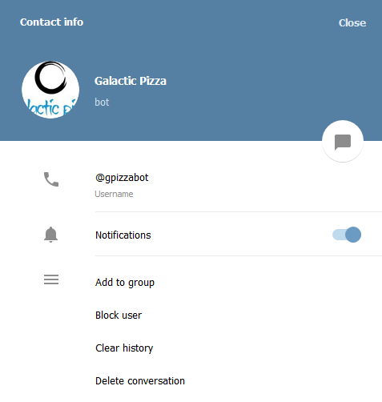

[![Contributors][contributors-shield]][contributors-url]
[![Issues][issues-shield]][issues-url]
 

 
  <h3 align="center">Telegram bot</h3>
  

    A telegram bot for lovers of pizza
     
    <a href="https://github.com/kalavhan/Telegram-bot/tree/feature-developer"><strong>Explore the docs »</strong></a>
     
     
    ·
    <a href="https://github.com/kalavhan/Telegram-bot/issues">Report Bug</a>
    ·
    <a href="https://github.com/kalavhan/Telegram-bot/issues">Request Feature</a>
  

<!-- TABLE OF CONTENTS -->
## Table of Contents

* [About the Project](#about-the-project)
  * [Built With](#built-with)
* [Use](#use)
* [Roadmap](#roadmap)
* [License](#license)
* [Contact](#contact)

<!-- ABOUT THE PROJECT -->
## About The Project

This telegram bot helps you to prepare a pizza giving you the ingredients and instructions required, it can send you jokes or random facts about pizza! 

### Objective

 - Give instructions and ingredients to prepare pizza through a command
 - Give a randome joke about pizza through a command
 - Give a random fact about pizza through a comman
 - Give an error message when a invalid command is given
 
### Assignment

  1. A bot developed in Ruby
  2. Recommended platforms: , , 
  3. The README must include instructions on how to use the bot (how to install it and use it)
    

### Built With

This project was built using Ruby as the main language and with the help of gem . 

## Prerequisites
 - 
 - 
 - 

## Getting Started

    1. Open Bash terminal
    2. Type "git clone https://github.com/kalavhan/Telegram-bot.git"
    3. Type "cd Telegram-bot"
    4. Type "bundle install" (in case of not having telegram-bot-ruby gem installed) 
    5. Type "bin/main.rb/"
    6. In telegram search bar type "gpizzabot"
    7. click "Start"

## Bot guide
- Search for **gpizzabot** in telegram search bar and select "Galactic Pizza"
  

    
  

- Be sure that this is the bot you selected
  

    
  

- Click "start" to begin to use the bot (Type **/help** in case you need the command list)
  

    
  

## Commands
    1. /start -- Greeting

    2. /help -- Show list of commands

    3. /pepperoni -- Show instructions of how to make a pepperoni pizza

    4. /hawaiian -- show instructions of how to make a hawaiian pizza

    5. /funfact -- show a random funfact about pizza

    6. /joke -- show a random joke about pizza

## Use
This Bot is designed with the intention of helping those who love pizza in the instructions needed to prepare a pepperoni or hawaiian pizza, it can be used as a way of entertaiment to read random jokes or fun facts about pizza

<!-- ROADMAP -->
## Roadmap

See the [open issues](https://github.com/kalavhan/Telegram-bot/issues/issues) for a list of proposed features (and known issues).

<!-- LICENSE -->
## License

Distributed under the MIT License. See `LICENSE` for more information.

<!-- CONTACT -->
## Contact
Josue Brigido - [Github profile](https://github.com/kalavhan)

Project Link: [Project repo](https://github.com/kalavhan/Telegram-bot/)

<!-- MARKDOWN LINKS & IMAGES -->
<!-- https://www.markdownguide.org/basic-syntax/#reference-style-links -->
[contributors-shield]: https://img.shields.io/badge/Contributors-2-%2300ff00
[contributors-url]: https://github.com/kalavhan/Telegram-bot/graphs/contributors
[issues-shield]: https://img.shields.io/badge/issues-0-%2300ff00
[issues-url]: https://github.com/kalavhan/Telegram-bot/issues

